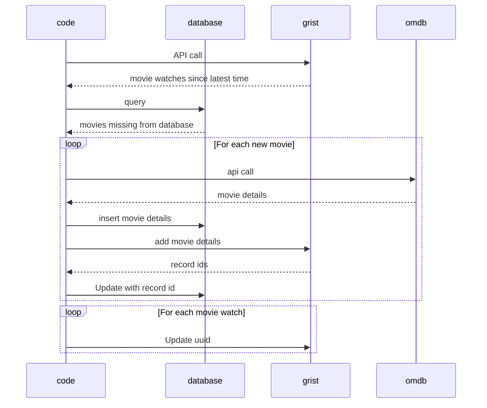

# movies-app
Silly personal project for building an automated DVC / Dash / Google Cloud workflow for movies I've watched.

I watch a lot of movies. I like the idea of something like letterboxd but would rather DIY it because I have more time than sense, apparently. Anyway, that's what we have here - a pipeline that runs weekly and pulls my Grist, enriches the movies with data from OMDB, then updates a SQLite database out of that and versions that with DVC.

The app is a dashboard in Grist that gets updated as well because I got tired of writing my own front end code.

Mostly I built this to develop an understanding of how to automate DVC-based workflows and use DVC to distribute data to endpoints and applications. At some point that turned into me wanting to rewrite it in Go cause I got tired of python.

## Data Model

The movie_watch table is an instance of the watched movie, everything else is effectively a dimension against the movie itself.

### Movie

| column           | type    | constraint  | default     |
| ---------------- | ------- | ----------- | ----------- |
| uuid             | TEXT    | PRIMARY KEY |             |
| title            | TEXT    | NOT NULL    |             |
| year             | INTEGER | NOT NULL    |             |
| rated            | TEXT    |             |             |
| released         | TEXT    |             |             |
| runtime_minutes  | INTEGER |             |             |
| plot             | TEXT    |             |             |
| country          | TEXT    |             |             |
| box_office       | TEXT    |             |             |
| production       | TEXT    |             |             |
| call_felissa     | INTEGER | NOT NULL    |             |
| slasher          | INTEGER | NOT NULL    |             |
| zombies          | INTEGER | NOT NULL    |             |
| beast            | INTEGER | NOT NULL    |             |
| godzilla         | INTEGER | NOT NULL    |             |
| grist_id         | INTEGER | UNIQUE      | NULL        |
| created_datetime | INTEGER | NOT NULL    | UNIXEPOCH() |

### Movie Watch

| column           | type    | constraint  | default     |
| ---------------- | ------- | ----------- | ----------- |
| uuid             | TEXT    | PRIMARY KEY |             |
| movie_uuid       | TEXT    | FOREIGN KEY |             |
| name             | TEXT    | NOT NULL    |             |
| grist_id         | INTEGER | UNIQUE      | NULL        |
| created_datetime | INTEGER | NOT NULL    | UNIXEPOCH() |

### Movie Genre
| column           | type    | constraint  | default     |
| ---------------- | ------- | ----------- | ----------- |
| uuid             | TEXT    | PRIMARY KEY |             |
| movie_uuid       | TEXT    | FOREIGN KEY |             |
| name             | TEXT    | NOT NULL    |             |
| grist_id         | INTEGER | UNIQUE      | NULL        |
| created_datetime | INTEGER | NOT NULL    | UNIXEPOCH() |

### Movie Actor

| column           | type    | constraint  | default     |
| ---------------- | ------- | ----------- | ----------- |
| uuid             | TEXT    | PRIMARY KEY |             |
| movie_uuid       | TEXT    | FOREIGN KEY |             |
| name             | TEXT    | NOT NULL    |             |
| grist_id         | INTEGER | UNIQUE      | NULL        |
| created_datetime | INTEGER | NOT NULL    | UNIXEPOCH() |

### Movie Director

| column           | type    | constraint  | default     |
| ---------------- | ------- | ----------- | ----------- |
| uuid             | TEXT    | PRIMARY KEY |             |
| movie_uuid       | TEXT    | FOREIGN KEY |             |
| name             | TEXT    | NOT NULL    |             |
| grist_id         | INTEGER | UNIQUE      | NULL        |
| created_datetime | INTEGER | NOT NULL    | UNIXEPOCH() |

### Movie Producer

| column           | type    | constraint  | default      |
| ---------------- | ------- | ----------- | ------------ |
| uuid             | TEXT    | PRIMARY KEY |              |
| movie_uuid       | TEXT    | FOREIGN KEY |              |
| name             | TEXT    | NOT NULL    |              |
| grist_id         | INTEGER | UNIQUE      | DEFAULT NULL |
| created_datetime | INTEGER | NOT NULL    | UNIXEPOCH()  |

### Movie Writer

| column           | type    | constraint  | default     |
| ---------------- | ------- | ----------- | ----------- |
| uuid             | TEXT    | PRIMARY KEY |             |
| movie_uuid       | TEXT    | FOREIGN KEY |             |
| source           | TEXT    | NOT NULL    |             |
| value            | TEXT    | NOT NULL    |             |
| grist_id         | INTEGER | UNIQUE      | NULL        |
| created_datetime | INTEGER | NOT NULL    | UNIXEPOCH() |

## Pipeline

