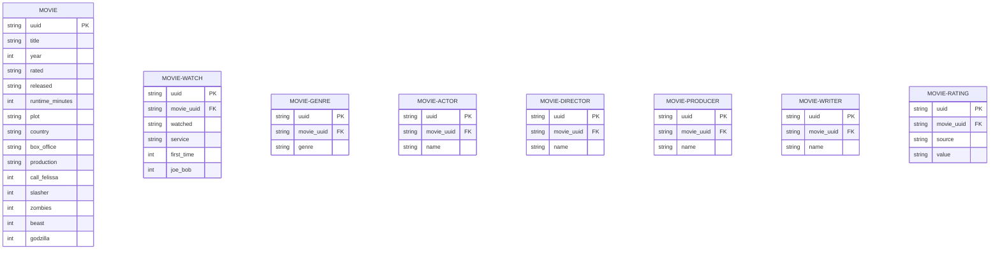

# movies-app
Silly personal project for building an automated DVC / Dash / Google Cloud workflow for movies I've watched.

I watch a lot of movies. I like the idea of something like letterboxd but would rather DIY it because I have more time than sense, apparently. Anyway, that's what we have here - a pipeline that runs weekly and pulls my Grist, enriches the movies with data from OMDB, then updates a SQLite database out of that and versions that with DVC.

The app is a dashboard in Grist that gets updated as well because I got tired of writing my own front end code.

Mostly I built this to develop an understanding of how to automate DVC-based workflows and use DVC to distribute data to endpoints and applications. At some point that turned into me wanting to rewrite it in Go cause I got tired of python.

The movie_watch table is an instance of the watched movie, everything else is effectively a dimension against the movie itself.

